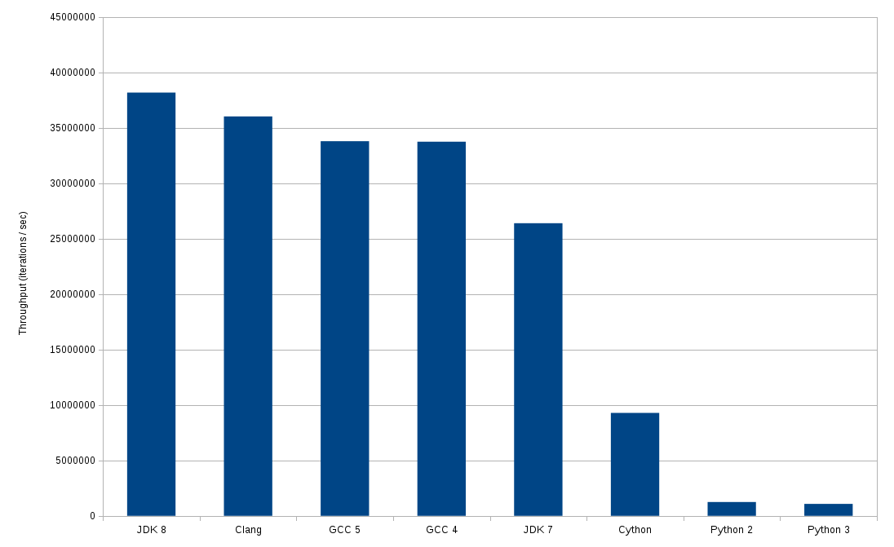

# Introduction

This project tests hash table performance across 3 different languages: C++, Java, and Python (including Cython). For C++, the STL's
[unordered_map](http://www.cplusplus.com/reference/unordered_map/unordered_map/) is used. For Java, the
[java.util.HashMap](https://docs.oracle.com/javase/8/docs/api/java/util/HashMap.html) class is used. For Python, the
[dict type](https://docs.python.org/2/library/stdtypes.html#mapping-types-dict) is used.

Each test repeatedly generates numbers between zero and 9999 and puts these into a hash table. Another random number is then retrieved from
the hash table. This is repeated for one billion iterations. There is a warm-up period of one hundred million iterations before the main test.

Note that the test makes no attempt to isolate has table performance from the other parts of the test, so it also tests the performance
of loop iteration, and some integer arithmetic. My assumption when designing the tests was that loop iteration and integer arithmetic would
be cheap compared to the hash table operations. However this does not appear to be the case for some languages (like Python, for example). See
the "Observations" section for further details.

# Results

The following results were obtained by running the tests:

 * Java 8 : 38,181,604 iterations / second
 * C++ (Clang): 36,032,097 iterations / second
 * C++ (GCC 5): 33,796,495 iterations / second
 * C++ (GCC 4): 33,749,350 iterations / second
 * Java 7: 26,399,361 iterations / second
 * Cython: 9,283,212 iterations / second
 * Python 2: 1,244,763 iterations / second
 * Python 3: 1,074,913 iterations / second

The results are presented in terms of iterations per second. In other words, how many times we can be update an entry in the hash table, then retrieve
another entry, in one second (higher is better).

So, compared to the fastest Java test, the fastest C++ test is about 1.05 times slower, and the Python 2 test is around 30 times slower. Cython
is around 4 times slower than the fastest Java test.

The following graph shows these results:



# Observations

Some observations on the results:

 * Python performed worse than I expected. I was expecting it to be slower than C++ and Java, but 30x slower seems like a lot.
 One problem seems to be that integer arithmetic in Python seems to take proportionally longer: around 60% of the test time, as opposed to around
 17% in Java 8. See [this issue](https://github.com/nfergu/hashtableperf/issues/1), where @grantjenks suggests that the python code can be made
 around 2x faster by avoiding the use of the integer arithmetic in the main loop. However this will presumably have implications for memory usage.
 He also has a suggestion for avoiding the method lookup for `map.get`, which in (limited) testing seems to give a speed-up for around 5%.

 * We can improve the performance of Java 8 further by turning on aggressive optimizations (-XX:+AggressiveOpts).
 With this setting we get a throughput of around 53 million iterations (as opposed to 38 million iterations). This appears
 to be due to the value of the [-XX:AutoBoxCacheMax flag](http://grepcode.com/file/repository.grepcode.com/java/root/jdk/openjdk/7-b147/java/lang/Integer.java#584):
 it is set to 20,000 instead of the default of 128 with aggressive optimizations turned on. In fact we can achieve equivalent results by
 setting -XX:AutoBoxCacheMax=20000 instead of -XX:+AggressiveOpts. This seems to indicate that object creation is relatively expensive in this test,
 since we can make it significantly faster by avoiding creation of Integer objects.

## Configuration

### Platform

All tests were performed on an [Intel E5-2609 v2 @ 2.50GHz](http://ark.intel.com/products/75787/Intel-Xeon-Processor-E5-2609-v2-10M-Cache-2_50-GHz)
running Ubuntu 14.04.

### GCC

GCC version 4.9.3 was used for the GCC 4 tests. GCC version 5.3.0 was used for the GCC 5 tests. The following options were used in both cases:

```
g++ -otesttableperf -std=c++11 -O3 src/test_table_perf.cpp
```

This compiles with an [optimization level](https://gcc.gnu.org/onlinedocs/gcc/Optimize-Options.html) of 3.
Different optimization levels were tried. Optimization levels 2 and 3 were the fastest (but there was not a significant difference levels 2 and 3).

### Clang

Clang version 3.8.0 was used for the Clang tests. The following options were used:

```
clang++ -otesttableperf -std=c++11 -O3 src/test_table_perf.cpp
```

This compiles with an optimization level of 3.
Different optimization levels were tried. Optimization levels 2 and 3 were the fastest (but there was not a significant difference levels 2 and 3).

### Java

The Java 8 tests were performed (compiled and executed) using Oracle JDK 1.8.0._74. The Java 7 tests were performed using Oracle JDK 1.7.0_79.
The tests were executed using the following options:

```
java -mx512m -XX:NewSize=128m -XX:MaxNewSize=128m -XX:-UseParallelOldGC -XX:ParallelGCThreads=1 TestTablePerf
```

These options have the effect of forcing frequent garbage collection (about 4 times per second) in the test. This means that the majority
of the garbage is collected by the end of the test loop (but just to be sure we call System.gc() before completing the test). A single thread
is used for garbage collection, since all of our tests are single-threaded.

### Python

The Python 2 tests were performed using Python 2.7.11. The Python 3 tests were performed using Python 3.5.1. No options were specified for the
python interpreter.

### Cython

The Cython tests were performed using Cython version 0.24, along with Python version 2.7.11 and GCC version 5.3.0. The following options were used for
Cython and GCC:

```
cython --embed -o src/test_table_perf_pyx.c  src/test_table_perf_pyx.pyx
gcc -O3 -I /usr/include/python2.7 -o src/test_table_perf_pyx src/test_table_perf_pyx.c -lpython2.7 -lpthread -lm -lutil -ldl
```

This compiles with an optimization level of 3. Other [optimization levels](https://gcc.gnu.org/onlinedocs/gcc/Optimize-Options.html) were tried,
but level 3 proved to be the fastest.

# Running the Tests

## GCC

```
g++ -otesttableperf -std=c++11 -O2 src/test_table_perf.cpp
./testtableperf
```

This assumes you have GCC installed.

## Clang

```
clang++ -otesttableperf -std=c++11 -O2 src/test_table_perf.cpp
./testtableperf
```

This assumes you have Clang installed.

## Java

```
javac -d . src/TestTablePerf.java
java -mx512m -XX:NewSize=128m -XX:MaxNewSize=128m -XX:-UseParallelOldGC -XX:ParallelGCThreads=1 TestTablePerf
```

This assumes you have a JDK installed.

## Python 2

```
python2 src/test_table_perf.py
```

This assumes you have python 2 installed.

## Python 3

```
python3 src/test_table_perf-python3.py
```

This assumes you have python 3 installed.

## Cython

```
cython --embed -o src/test_table_perf_pyx.c  src/test_table_perf_pyx.pyx
gcc -O3 -I /usr/include/python2.7 -o src/test_table_perf_pyx src/test_table_perf_pyx.c -lpython2.7 -lpthread -lm -lutil -ldl
src/test_table_perf_pyx
```

This assumes you have Cython and GCC installed.

# Feedback

I would appreciate feedback on the tests, particularly on possible performance improvements. Please open an issue or pull request in Github.